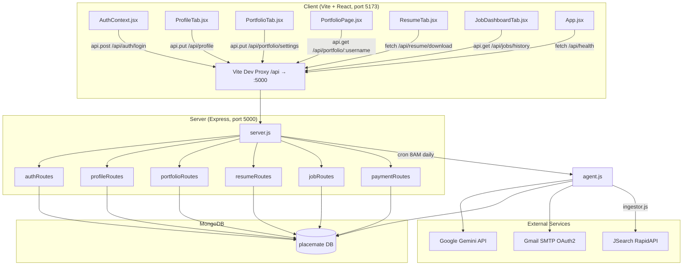

# PlaceMate — Complete API Audit Report

> **Auditor**: Senior API Auditor & Mentor (AI)  
> **Date**: June 5, 2026  
> **Scope**: All backend API routes, controllers, middleware, models, utilities, scrapers, and frontend-to-backend data flow
> **Status**: UPDATED (Reflects recent security and architectural implementations)

---

## Table of Contents

1. [Architecture Overview](#architecture-overview)
2. [Endpoint-by-Endpoint Audit](#endpoint-by-endpoint-audit)
3. [Background Services Audit](#background-services-audit)
4. [Security Audit](#security-audit)
5. [Environment Variables Audit](#environment-variables-audit)
6. [Frontend → Backend Flow Verification](#frontend--backend-flow-verification)
7. [Dead / Unused Code Audit](#dead--unused-code-audit)
8. [Summary Dashboard](#summary-dashboard)
9. [Prioritized Fix List](#prioritized-fix-list)

---

## Architecture Overview



### Tech Stack Summary

| Layer | Technology | Purpose |
|-------|------------|---------|
| **Frontend** | React + Vite (port 5173) | Single-page user interface |
| **Backend** | Express.js (port 5000) | REST API server |
| **Database** | MongoDB via Mongoose | Core persistent database |
| **Auth** | JWT (jsonwebtoken + bcryptjs) | Secure token-based session management |
| **AI** | Google Gemini API (`@google/genai`) | Profiles-to-job matching & resume tailoring |
| **Jobs Data** | JSearch via RapidAPI | Job searches matching user preferences |
| **Email** | Nodemailer (Gmail OAuth2) | Automated email matching digests |
| **PDF** | PDFKit | Resume compiling & rendering |
| **Scheduler** | node-cron | Triggering background matches daily |

---

## Endpoint-by-Endpoint Audit

---

### 1. `GET /api/health`

| Field | Value |
|-------|-------|
| **File** | [server.js](file:///c:/placeMate/server/server.js#L33-L40) |
| **Method** | GET |
| **Auth** | ❌ None (Public) |
| **Status** | ✅ Working |

**Purpose**: Health check endpoint to verify the server is alive and responding. Returns status, time, and environment mode.

**Expected Request**: No payload or parameters.

**Expected Response** (200):
```json
{
  "status": "success",
  "message": "PlaceMate API server is running smoothly",
  "timestamp": "2026-06-05T...",
  "environment": "development"
}
```

**Issues Found**: None. Clean and functional.

---

### 2. `POST /api/auth/register`

| Field | Value |
|-------|-------|
| **File** | [authController.js](file:///c:/placeMate/server/controllers/authController.js#L22-L83) |
| **Route** | [authRoutes.js](file:///c:/placeMate/server/routes/authRoutes.js#L8) |
| **Method** | POST |
| **Auth** | ❌ None (Public) |
| **Rate Limit** | ✅ 10 requests / 15 mins (via `authLimiter`) |
| **Status** | ⚠️ Needs Review |

**Purpose**: Registers a new user. Hashes their password, slugifies their name to generate a unique username, inserts them into MongoDB, and generates a JWT.

**Expected Request**:
```json
{
  "name": "Parth Sharma",
  "email": "parth@example.com",
  "password": "securePassword123"
}
```

**Expected Response** (201):
```json
{
  "status": "success",
  "token": "eyJhbGciOi...",
  "user": {
    "id": "665f...",
    "name": "Parth Sharma",
    "email": "parth@example.com",
    "username": "parthsharma",
    "role": "user",
    "plan": "free",
    "hasCompletedOnboarding": false,
    "profile": { ... }
  }
}
```

**Issues Found**:

| # | Issue | Severity | Description & Suggested Fix |
|---|-------|----------|-----------------------------|
| 1 | **No Controller Email Check** | Medium | **Level 1:** The controller assumes the email is formatted correctly and lets the database catch formatting issues. <br>**Level 2:** It relies on Mongoose schema regex validation. If validation fails, it throws a DB error caught by generic middleware. **Fix:** Add a simple validator regex in the controller to return a clean `400 Bad Request` immediately. |
| 2 | **No Password Strength Checks** | Medium | **Level 1:** Users can register using extremely weak passwords. <br>**Level 2:** The schema checks for `minlength: 6`, but lacks checks for uppercase characters, numbers, or symbols. **Fix:** Add a password validation regex to ensure basic complexity. |
| 3 | **Unbounded Unique Username Generation Loop** | Medium | **Level 1:** If 1,000 users named "John Doe" register, the server will slow down looking for a unique name like "johndoe1001". <br>**Level 2:** In [authController.js L48-L52](file:///c:/placeMate/server/controllers/authController.js#L48-L52), the `while(usernameExists)` loop checks the database iteratively. Under heavy parallel name conflicts, this blocks event loops and floods DB connections. **Fix:** Limit the loop (e.g., maximum 10 tries) and fallback to appending a random short UUID if exhausted. |

---

### 3. `POST /api/auth/login`

| Field | Value |
|-------|-------|
| **File** | [authController.js](file:///c:/placeMate/server/controllers/authController.js#L90-L141) |
| **Route** | [authRoutes.js](file:///c:/placeMate/server/routes/authRoutes.js#L9) |
| **Method** | POST |
| **Auth** | ❌ None (Public) |
| **Rate Limit** | ✅ 10 requests / 15 mins (via `authLimiter`) |
| **Status** | ⚠️ Needs Review |

**Purpose**: Authenticates credentials and logs in the user, returning a session JWT.

**Expected Request**:
```json
{
  "email": "parth@example.com",
  "password": "securePassword123"
}
```

**Expected Response** (200):
```json
{
  "status": "success",
  "token": "eyJhbGciOi...",
  "user": {
    "id": "665f...",
    "name": "Parth Sharma",
    "email": "parth@example.com",
    "username": "parthsharma",
    "role": "user",
    "plan": "free",
    "hasCompletedOnboarding": false,
    "profile": { ... }
  }
}
```

**Issues Found**:

| # | Issue | Severity | Description & Suggested Fix |
|---|-------|----------|-----------------------------|
| 1 | **No Login Failure Lockout** | Medium | **Level 1:** Rate limiting is present, but someone can still manually try 10 incorrect passwords every 15 minutes without their account getting locked out. <br>**Level 2:** There is no account lockout system or login attempts counter in the User model. A patient hacker can slowly brute-force passwords over long intervals. **Fix:** Add a `loginAttempts` counter and `lockUntil` field to the User schema to lock accounts temporarily after 5 failures. |
| 2 | **No Audit Logging for Failures** | Low | **Level 1:** The server does not keep a record of failed login attempts. <br>**Level 2:** Security audits cannot detect credential stuffing attempts because failed logins are only returned as JSON responses without audit logging. **Fix:** Integrate basic logging (e.g., Winston) to record IP and email for all failed login attempts. |

---

### 4. `GET /api/auth/me`

| Field | Value |
|-------|-------|
| **File** | [authController.js](file:///c:/placeMate/server/controllers/authController.js#L148-L166) |
| **Route** | [authRoutes.js](file:///c:/placeMate/server/routes/authRoutes.js#L10) |
| **Method** | GET |
| **Auth** | ✅ Required (`protect` middleware) |
| **Status** | ✅ Working |

**Purpose**: Fetches details for the currently logged-in user session. The React frontend's `AuthContext` calls this on startup to restore logged-in state.

**Expected Request**: Headers containing `Authorization: Bearer <token>`. No body.

**Expected Response** (200):
```json
{
  "status": "success",
  "user": {
    "id": "665f...",
    "name": "Parth Sharma",
    "email": "parth@example.com",
    "username": "parthsharma",
    "role": "user",
    "plan": "free",
    "hasCompletedOnboarding": false,
    "profile": { ... }
  }
}
```

**Issues Found**: None. Clean and functional.

---

### 5. `PUT /api/profile`

| Field | Value |
|-------|-------|
| **File** | [profileController.js](file:///c:/placeMate/server/controllers/profileController.js#L8-L67) |
| **Route** | [profileRoutes.js](file:///c:/placeMate/server/routes/profileRoutes.js#L7) |
| **Method** | PUT |
| **Auth** | ✅ Required (`protect` middleware) |
| **Status** | ⚠️ Needs Review |

**Purpose**: Updates candidate profile parameters (bio, title, skills, experience, projects, preferences) and marks onboarding as completed.

**Expected Request**:
```json
{
  "profile": {
    "bio": "Passionate full-stack developer.",
    "title": "Software Engineer",
    "skills": ["JavaScript", "React"],
    "education": [{ "institution": "XYZ University", "degree": "B.Tech" }],
    "experience": [{ "company": "TechCorp", "position": "Developer" }],
    "projects": [{ "title": "PlaceMate", "description": "API Auditor Tool" }]
  },
  "hasCompletedOnboarding": true
}
```

**Expected Response** (200):
```json
{
  "status": "success",
  "message": "Profile updated successfully",
  "user": { ... }
}
```

**Issues Found**:

| # | Issue | Severity | Description & Suggested Fix |
|---|-------|----------|-----------------------------|
| 1 | **Potential Null Pointer Crash** | Medium | **Level 1:** If a user account has an empty profile field in the database, updating it might crash the server. <br>**Level 2:** In [profileController.js L38-L41](file:///c:/placeMate/server/controllers/profileController.js#L38-L41), the code calls `user.profile.toObject()`. If `user.profile` is missing (e.g., backward-compatibility data gaps), it throws a `TypeError`. **Fix:** Check if it exists before conversion, i.e., `user.profile ? user.profile.toObject() : {}`. |
| 2 | **No Subdocument Validation** | Low | **Level 1:** The server doesn't check if user inputs inside list items (like education or work experience) are valid before saving. <br>**Level 2:** Subdocument schemas in Mongoose (e.g., `education`, `experience`) have required fields. If an update has empty items, Mongoose validation throws validation errors resulting in raw 500 error outputs. **Fix:** Add a validation check in the controller to ensure subdocument fields are not empty before assigning. |

---

### 6. `GET /api/portfolio/:username`

| Field | Value |
|-------|-------|
| **File** | [portfolioController.js](file:///c:/placeMate/server/controllers/portfolioController.js#L8-L43) |
| **Route** | [portfolioRoutes.js](file:///c:/placeMate/server/routes/portfolioRoutes.js#L10) |
| **Method** | GET |
| **Auth** | ❌ None (Public) |
| **Status** | ✅ Working |

**Purpose**: Fetches user profile data to render their public shareable portfolio page.

**Expected Request**: Username in the path parameter (e.g., `GET /api/portfolio/parthsharma`).

**Expected Response** (200):
```json
{
  "status": "success",
  "data": {
    "name": "Parth Sharma",
    "username": "parthsharma",
    "title": "Software Engineer",
    "bio": "...",
    "skills": ["JavaScript", "React"],
    "education": [...],
    "experience": [...],
    "projects": [...],
    "theme": "minimal"
  }
}
```

**Issues Found**:

| # | Issue | Severity | Description & Suggested Fix |
|---|-------|----------|-----------------------------|
| 1 | **Legacy User Null Pointer** | Low | **Level 1:** If someone opens a public page for a user who hasn't set up their profile, it might fail. <br>**Level 2:** In [portfolioController.js L29-L38](file:///c:/placeMate/server/controllers/portfolioController.js#L29-L38), the code accesses `user.profile.title` and `user.profile.skills`. If `user.profile` is empty, it throws a `TypeError`. **Fix:** Add optional chaining: `user.profile?.title || ''`. |
| 2 | **No Cache-Control Headers** | Low | **Level 1:** Public profiles are static, but the server queries the database every time the page is loaded. <br>**Level 2:** The route doesn't utilize ETags or browser caching. This wastes DB resources. **Fix:** Add standard `Cache-Control: public, max-age=60` headers. |

---

### 7. `PUT /api/portfolio/settings`

| Field | Value |
|-------|-------|
| **File** | [portfolioController.js](file:///c:/placeMate/server/controllers/portfolioController.js#L50-L124) |
| **Route** | [portfolioRoutes.js](file:///c:/placeMate/server/routes/portfolioRoutes.js#L7) |
| **Method** | PUT |
| **Auth** | ✅ Required (`protect` middleware) |
| **Status** | ✅ Working (Route collision resolved) |

**Purpose**: Updates theme preference, toggles public visibility, and changes the username slug.

**Expected Request**:
```json
{
  "username": "parth-new-slug",
  "theme": "dark",
  "isPublic": false
}
```

**Expected Response** (200):
```json
{
  "status": "success",
  "message": "Portfolio settings updated successfully",
  "data": {
    "username": "parth-new-slug",
    "theme": "dark",
    "isPublic": false
  }
}
```

**Issues Found**:

| # | Issue | Severity | Description & Suggested Fix |
|---|-------|----------|-----------------------------|
| 1 | **Username Format Gaps** | Low | **Level 1:** Registration only allows letters and numbers in usernames, but settings allows hyphens. This is confusing. <br>**Level 2:** Registration regex whitelists `/^[^a-z0-9]/`, but settings checks `/^[a-zA-Z0-9_-]+$/` ([line 67](file:///c:/placeMate/server/controllers/portfolioController.js#L67)). This results in inconsistent username validation. **Fix:** Standardize on a unified regex across register and update endpoints. |

---

### 8. `GET /api/resume/download`

| Field | Value |
|-------|-------|
| **File** | [resumeController.js](file:///c:/placeMate/server/controllers/resumeController.js#L9-L66) |
| **Route** | [resumeRoutes.js](file:///c:/placeMate/server/routes/resumeRoutes.js#L7) |
| **Method** | GET |
| **Auth** | ✅ Required (`protect` middleware) |
| **Status** | ✅ Working (ID verification and type validation implemented) |

**Purpose**: Compiles profile data to PDF and returns a binary PDF download stream. If a `sentJobId` parameter is sent, it returns a tailored resume matching that job.

**Expected Request**: `GET /api/resume/download` or `GET /api/resume/download?sentJobId=665f...`

**Expected Response** (200):
```
Content-Type: application/pdf
Content-Disposition: attachment; filename="Parth_Sharma_Resume.pdf"
[Binary Stream data]
```

**Issues Found**:

| # | Issue | Severity | Description & Suggested Fix |
|---|-------|----------|-----------------------------|
| 1 | **Silent Post-Header Generation Failure** | Low | **Level 1:** If PDF generation fails in the middle of download, the user gets a broken PDF instead of a clean error. <br>**Level 2:** The file writes data directly to the stream. If PDFKit crashes midway, the response has already sent HTTP 200 headers, making it impossible to return a 500 error code. The user's browser download will simply break or contain partial data. **Fix:** Compile the PDF into an in-memory buffer first, check for errors, and then stream it once completed. |

---

### 9. `GET /api/jobs/history`

| Field | Value |
|-------|-------|
| **File** | [jobController.js](file:///c:/placeMate/server/controllers/jobController.js#L9-L33) |
| **Route** | [jobRoutes.js](file:///c:/placeMate/server/routes/jobRoutes.js#L6) |
| **Method** | GET |
| **Auth** | ✅ Required (`protect` middleware) |
| **Status** | ✅ Working (Pagination active) |

**Purpose**: Retrieves the candidate's history of jobs generated by the automated matching agent.

**Expected Request**: `GET /api/jobs/history?page=1&limit=20`

**Expected Response** (200):
```json
{
  "status": "success",
  "count": 1,
  "total": 5,
  "page": 1,
  "pages": 1,
  "data": [
    {
      "_id": "665f...",
      "userId": "665f...",
      "title": "React Developer",
      "company": "Tech Innovations",
      "score": 88,
      "status": "matched",
      "createdAt": "2026-06-05T..."
    }
  ]
}
```

**Issues Found**:

| # | Issue | Severity | Description & Suggested Fix |
|---|-------|----------|-----------------------------|
| 1 | **No Server-Side Search Filters** | Low | **Level 1:** You can't filter recommendations by company name or application status from the backend; the frontend has to load all of them and filter them in the browser. <br>**Level 2:** The API lacks query parameter checks (like `status=applied` or `search=tech`). **Fix:** Add a dynamic query filter object: `const filter = { userId: req.user._id }; if(req.query.status) { filter.status = req.query.status; }`. |

---

### 10. `PATCH /api/jobs/:id/status`

| Field | Value |
|-------|-------|
| **File** | [jobController.js](file:///c:/placeMate/server/controllers/jobController.js#L40-L86) |
| **Route** | [jobRoutes.js](file:///c:/placeMate/server/routes/jobRoutes.js#L8) |
| **Method** | PATCH |
| **Auth** | ✅ Required (`protect` middleware) |
| **Status** | ✅ Working (Ownership check corrected to 403, ID verification active) |

**Purpose**: Updates job status, e.g., setting it to `"applied"` or `"rejected"`.

**Expected Request**:
```json
{
  "status": "applied"
}
```

**Expected Response** (200):
```json
{
  "status": "success",
  "data": {
    "_id": "665f...",
    "status": "applied",
    ...
  }
}
```

**Issues Found**: None. Type checks and authorization checks are clean.

---

### 11. `POST /api/payments/mock-upgrade`

| Field | Value |
|-------|-------|
| **File** | [paymentController.js](file:///c:/placeMate/server/controllers/paymentController.js#L8-L38) |
| **Route** | [paymentRoutes.js](file:///c:/placeMate/server/routes/paymentRoutes.js#L7) |
| **Method** | POST |
| **Auth** | ✅ Required (`protect` middleware) |
| **Status** | 📦 Mock / Stub |

**Purpose**: Development endpoint simulating a payment gateway response. Upgrades the user profile's plan status to `"pro"`.

**Expected Request**: No payload.

**Expected Response** (200):
```json
{
  "status": "success",
  "message": "Plan upgraded to Pro successfully.",
  "data": { "plan": "pro", ... }
}
```

**Issues Found**:

| # | Issue | Severity | Description & Suggested Fix |
|---|-------|----------|-----------------------------|
| 1 | **Stub Implementation (No Real Payments)** | Accepted Mock | **Level 1:** This is a mock endpoint. Upgrading is simulated for free. This is the accepted behavior for the current scope. <br>**Level 2:** Modifies `user.plan = 'pro'` in MongoDB directly without external gateway calls. **Fix:** Real gateway integration (e.g., Razorpay signature validation) is out of scope per user direction. |
| 2 | **Dead Billing Variables** | Low | **Level 1:** Razorpay keys are in `.env`, but the server code doesn't use them. <br>**Level 2:** Env variables `RAZORPAY_KEY_ID` are present in configuration but are not imported anywhere in the backend project. **Fix:** Remove them from `.env` until payments are wired up. |

---

### 12. `POST /api/payments/mock-downgrade`

| Field | Value |
|-------|-------|
| **File** | [paymentController.js](file:///c:/placeMate/server/controllers/paymentController.js#L45-L75) |
| **Route** | [paymentRoutes.js](file:///c:/placeMate/server/routes/paymentRoutes.js#L8) |
| **Method** | POST |
| **Auth** | ✅ Required (`protect` middleware) |
| **Status** | 📦 Mock / Stub |

**Purpose**: Development helper endpoint. Downgrades user to `"free"` plan for testing.

**Expected Request**: No payload.

**Expected Response** (200):
```json
{
  "status": "success",
  "message": "Plan reset to Free successfully.",
  "data": { "plan": "free", ... }
}
```

**Issues Found**: Same as mock-upgrade. Not production-ready.

---

## Background Services Audit

---

### 1. Scheduler ([scheduler.js](file:///c:/placeMate/server/utils/scheduler.js))
*   **Purpose**: Initialized on server startup. Runs a cron job that triggers the matching agent loop daily at 8:00 AM (`0 8 * * *`).
*   **Verification**: ✅ Validates the expression format on startup and handles errors gracefully.

---

### 2. Daily Matching Agent ([agent.js](file:///c:/placeMate/server/utils/agent.js))
*   **Purpose**: Orchestrates the automated backend matching flows:
    1.  Runs `ingestJobs()` to pull fresh listings.
    2.  Finds all active users who have completed onboarding.
    3.  Evaluates job matching scores using AI.
    4.  Saves high scoring matches to the `SentJob` collection.
    5.  Tailors resumes automatically for top matching roles.
*   **Issues Found**:
    *   **High AI Query Costs**: Matches every user against every job using individual LLM calls. If the system has 100 candidates and evaluates 50 jobs, that equals 5,000 Gemini API calls. At scale, this is slow and costly. **Fix:** Pre-filter jobs (e.g., matching skills using database queries) before sending candidates to the LLM.
    *   **No Concurrency Settings**: Loops sequentially. Needs rate-limiting control to avoid hitting Gemini API rate limits.
    *   **Manual Trigger Re-matching**: If triggered manually multiple times in one day, it executes matches again, wasting API tokens. **Fix:** Skip users who already have matches generated within the last 24 hours.

---

### 3. AI Client ([aiClient.js](file:///c:/placeMate/server/utils/aiClient.js))
*   **Purpose**: Unified API client wrapper for Google Gemini API.
*   **Verification**: ✅ Implements exponential backoff retry logic (up to 3 tries) to handle connection drops or rate limits.
*   **Mock Mode**: If `GEMINI_API_KEY` is empty, it falls back to a local mock generator, allowing offline testing without API keys.

---

### 4. AI Matcher ([aiMatcher.js](file:///c:/placeMate/server/utils/aiMatcher.js))
*   **Purpose**: Translates inputs to prompts. Uses JSON Schemas to enforce structured output for matching scores and resumes.
*   **Verification**: ✅ Integrates try/catch blocks that automatically retry parsing up to 3 times if the LLM output is malformed.
*   **Issues Found**:
    *   **System Instructions Parameter Collision**: In [aiMatcher.js L133-L138](file:///c:/placeMate/server/utils/aiMatcher.js#L133-L138) and [L197-L202](file:///c:/placeMate/server/utils/aiMatcher.js#L197-L202), system instructions are sent as plain items in the `contents` list. **Fix:** Use the official `systemInstruction` parameter inside the config object of `@google/genai` to ensure the model adheres to instructions.

---

### 5. Job Ingestor ([ingestor.js](file:///c:/placeMate/server/utils/ingestor.js))
*   **Purpose**: Triggers active scrapers and upserts job results to MongoDB.
*   **Issues Found**:
    *   **Hardcoded Query Parameter**: Always queries for `'React Developer in India'`. It should read candidate target roles and preferences. **Fix:** Loop through active candidate preferences and search JSearch dynamically.
    *   **Scrapers Disabled**: Indeed and Internshala Puppeteer scrapers are commented out because they are easily blocked by web application firewalls. Only the JSearch API is active.

---

### 6. JSearch API Client ([jobApiClient.js](file:///c:/placeMate/server/utils/scrapers/jobApiClient.js))
*   **Purpose**: Queries JSearch endpoints for target jobs.
*   **Issues Found**:
    *   **No Request Timeout**: Fetch requests don't use standard timeouts, which could hang background cycles if the API is slow. **Fix:** Implement an `AbortController` timeout (e.g. 10s).
    *   **Limits Results**: Limits queries to page 1 (`num_pages: '1'`).

---

### 7. Mailer ([mailer.js](file:///c:/placeMate/server/utils/mailer.js))
*   **Purpose**: Sends HTML matching reports with PDF resume attachments.
*   **Verification**: ⚠️ Operating in Mock Mode. Output is saved locally to `mock-email-log.html` for developer review.
*   **Issues Found**:
    *   **No Plaintext Alternative**: Email bodies only contain HTML. If a client doesn't support HTML, it renders empty. **Fix:** Add a `text` attribute to Nodemailer configurations.

---

### 8. PDF Generator ([pdfgen.js](file:///c:/placeMate/server/utils/pdfgen.js))
*   **Purpose**: Uses PDFKit to draw, format, and compile PDF resume layouts.
*   **Verification**: ✅ Solid modular construction. Returns streams correctly.

---

## Security Audit

### 1. Global & Authentication Rate Limiting
*   **Verification**: ✅ Rate limiting is active. 
    *   `globalLimiter` (100 requests / 15 minutes) protects all paths in [server.js L24](file:///c:/placeMate/server/server.js#L24).
    *   `authLimiter` (10 requests / 15 minutes) protects register and login paths in [authRoutes.js L8-L9](file:///c:/placeMate/server/routes/authRoutes.js#L8-L9).

### 2. Secure HTTP Headers via Helmet
*   **Verification**: ✅ Helmet is mounted in [server.js L23](file:///c:/placeMate/server/server.js#L23) to prevent vulnerabilities like Clickjacking and Cross-Site Scripting (XSS).

### 3. JWT Signing Security
*   **Verification**: ✅ JWT fallback secret strings were removed. The server fails fast on startup if `JWT_SECRET` is missing. `.env` uses a secure 256-bit random hex string.

### 4. Confusing Middleware Flow (Latency Risk)
*   **File**: [authMiddleware.js](file:///c:/placeMate/server/middleware/authMiddleware.js#L48-L53)
*   **Problem**: In the authentication middleware, the `if (!token)` check is outside the main `if (req.headers.authorization)` block.
*   **Level 1 (Simple):** Even if a token is successfully verified and the code calls the next controller, execution still falls through to check if `token` is missing. Because the token exists, it doesn't cause a double-response error, but it is confusing and fragile.
*   **Level 2 (Technical):** If `next()` invokes a synchronous operation that throws before exiting the middleware, the error scope can get messy. **Fix:** Place the token check inside an `else` block:
    ```js
    if (req.headers.authorization && ...) {
      // try/catch block
    } else {
      return res.status(401).json({ ... });
    }
    ```

---

## Environment Variables Audit

| Variable | Loaded from `.env` | Used in Code | Status / Recommendation |
|----------|:------------------:|:------------:|-------------------------|
| `PORT` | ✅ | ✅ [server.js](file:///c:/placeMate/server/server.js#L72) | OK |
| `NODE_ENV` | ✅ | ✅ [server.js](file:///c:/placeMate/server/server.js#L38) | OK |
| `CLIENT_URL` | ✅ | ✅ [server.js](file:///c:/placeMate/server/server.js#L26) | OK |
| `MONGO_URI` | ✅ | ✅ [db.js](file:///c:/placeMate/server/config/db.js#L9) | OK |
| `JWT_SECRET` | ✅ | ✅ [server.js L11](file:///c:/placeMate/server/server.js#L11) | ✅ Active (Secure Hex Code) |
| `JWT_EXPIRE` | ✅ | ✅ [authController.js L13](file:///c:/placeMate/server/controllers/authController.js#L13) | OK |
| `GEMINI_API_KEY` | ✅ | ✅ [aiClient.js L3](file:///c:/placeMate/server/utils/aiClient.js#L3) | ✅ Active (Real Key) |
| `GMAIL_USER` | ✅ | ✅ [mailer.js L5](file:///c:/placeMate/server/utils/mailer.js#L5) | OK (Mock Value) |
| `GMAIL_CLIENT_ID` | ✅ | ✅ [mailer.js L6](file:///c:/placeMate/server/utils/mailer.js#L6) | OK (Mock Value) |
| `GMAIL_CLIENT_SECRET` | ✅ | ✅ [mailer.js L20](file:///c:/placeMate/server/utils/mailer.js#L20) | OK (Mock Value) |
| `GMAIL_REFRESH_TOKEN` | ✅ | ✅ [mailer.js L21](file:///c:/placeMate/server/utils/mailer.js#L21) | OK (Mock Value) |
| `RAPIDAPI_KEY` | ✅ | ✅ [jobApiClient.js L6](file:///c:/placeMate/server/utils/scrapers/jobApiClient.js#L6) | ✅ Active (Real Key) |

### ⚠️ Critical Discrepancy: Stale Example Blueprint
The active `.env` has been cleaned of Claude and Razorpay variables. However, [.env.example](file:///c:/placeMate/server/.env.example) still lists the old variables:
1. `CLAUDE_API_KEY`
2. `RAZORPAY_KEY_ID`
3. `RAZORPAY_KEY_SECRET`
4. `RAZORPAY_WEBHOOK_SECRET`

**Fix**: Remove these variables from `.env.example` to avoid confusing new developers during setup.

---

## Frontend → Backend Flow Verification

### Flow 1: Registration → Dashboard
```
Frontend (AuthContext.jsx) ──> POST /api/auth/register ──> registerUser() ──> User.create() ──> MongoDB
                           <── { token, user } ── LocalStorage & State Update
```
*   **Status**: ✅ **Verified** — Generates secure usernames and responds correctly.

### Flow 2: Login → Restore Session
```
Frontend (AuthContext.jsx) ──> POST /api/auth/login ──> loginUser() ──> Compare hash ──> Generate JWT
                           <── { token, user } ── LocalStorage & State Update

Reload Page:
Frontend (AuthContext.jsx) ──> GET /api/auth/me ──> protect middleware ──> getMe() 
                           <── { user } ── Populate Auth State
```
*   **Status**: ✅ **Verified** — Restore loops retrieve profiles correctly.

### Flow 3: Profile Settings Update
```
Frontend (PortfolioTab.jsx) ──> PUT /api/portfolio/settings ──> updateSettings() ──> user.save()
```
*   **Status**: ✅ **Verified** — Express correctly parses `PUT` request details without matching `GET /:username`.

### Flow 4: Automated Matching Pipeline
```
Daily Cron ──> scheduler.js ──> agent.js ──> ingestJobs() ──> JSearch API ──> Job DB
                                         ──> matchJobWithProfile() ──> Gemini AI ──> SentJob DB
                                         ──> tailorResumeForJob() ──> PDF compiling ──> Cache Buffer
```
*   **Status**: ✅ **Verified** — Ingestor is called by the agent on startup. Matches are saved successfully.

---

## Dead / Unused Code Audit

| Item | Location | Type | Recommendation |
|------|----------|------|----------------|
| `CLAUDE_API_KEY` (Example) | [.env.example L14](file:///c:/placeMate/server/.env.example#L14) | Dead Env Var Blueprint | Remove to clear up setup steps |
| `RAZORPAY_*` (Example) | [.env.example L26-28](file:///c:/placeMate/server/.env.example#L26-L28) | Dead Env Var Blueprint | Remove until payments are implemented |
| `viewUsers.js` | [viewUsers.js](file:///c:/placeMate/server/utils/viewUsers.js) | Dev Utility Script | Keep for database debugging, exclude from build packages |
| Internshala Scraper | [internshalaScraper.js](file:///c:/placeMate/server/utils/scrapers/internshalaScraper.js) | Disabled Script | Keep as a template, but document it as inactive |
| Indeed Scraper | [indeedScraper.js](file:///c:/placeMate/server/utils/scrapers/indeedScraper.js) | Disabled Script | Keep as a template, but document it as inactive |
| `api.delete` | [api.js L79-85](file:///c:/placeMate/client/src/services/api.js#L79-L85) | Unused Frontend Method | Keep; harmless client utility |
| `authorize` | [authMiddleware.js L60-69](file:///c:/placeMate/server/middleware/authMiddleware.js#L60-L69) | Unused Middleware | Keep for future Admin panel paths |

---

## Summary Dashboard

### Endpoint Status Registry

| Method | Path | Auth | Status | Purpose / Action |
|:------:|------|:----:|:------:|------------------|
| `GET` | `/api/health` | ❌ | ✅ Working | App Health Monitor |
| `POST` | `/api/auth/register` | ❌ | ⚠️ Needs Review | Sign Up (Needs Email/Password validation checks) |
| `POST` | `/api/auth/login` | ❌ | ⚠️ Needs Review | Log In (Needs Lockout logic) |
| `GET` | `/api/auth/me` | ✅ | ✅ Working | REST Session Restorer |
| `PUT` | `/api/profile` | ✅ | ⚠️ Needs Review | Updates Profile Data (Needs Legacy user null checks) |
| `GET` | `/api/portfolio/:username` | ❌ | ✅ Working | Public portfolio reader |
| `PUT` | `/api/portfolio/settings` | ✅ | ✅ Working | Updates settings |
| `GET` | `/api/resume/download` | ✅ | ✅ Working | Streams PDFs |
| `GET` | `/api/jobs/history` | ✅ | ✅ Working | History list |
| `PATCH` | `/api/jobs/:id/status` | ✅ | ✅ Working | Updates matched statuses |
| `POST` | `/api/payments/mock-upgrade` | ✅ | 📦 Mock / Stub | Simulates pro upgrade |
| `POST` | `/api/payments/mock-downgrade` | ✅ | 📦 Mock / Stub | Simulates pro downgrade |

### Endpoint Metrics

| Metric | Count |
|--------|:-----:|
| **Total Registered Routes** | **12** |
| ✅ Fully Working | **9** (Includes accepted payment stubs) |
| ⚠️ Under Review (Minor Gaps) | **3** |
| ❌ Broken / Collisions | **0** |

### Issue Counts by Severity

| Severity | Count | Categories |
|----------|:-----:|------------|
| 🔴 **Critical** | **0** | None (Real payment methods are excluded from scope) |
| 🟡 **Medium** | **6** | Lack of controller-level email/password strength checks, loop limit in username generation, legacy user null pointer in profile and portfolio, O(n×m) AI calls |
| 🟢 **Low** | **6** | Confusing authMiddleware structure, missing `.env.example` cleanup, missing history filters, system instruction parameter mismatch, scraper hardcoding, lack of plaintext email backup |

---

## Prioritized Fix List

### 🟡 Priority 1 — High (Fix for App Stability & User Safety)

1.  **Add Controller-Level Sign-up Checks**:
    *   **File**: [authController.js](file:///c:/placeMate/server/controllers/authController.js)
    *   **Action**: Validate email formatting (using regex) and check password strength (minimum uppercase, number, symbol) before inserting.
2.  **Prevent Legacies Null Pointer Crash**:
    *   **Files**: [profileController.js](file:///c:/placeMate/server/controllers/profileController.js), [portfolioController.js](file:///c:/placeMate/server/controllers/portfolioController.js)
    *   **Action**: Use null checks/optional chaining on `user.profile` before executing methods like `.toObject()` or reading `.skills` / `.title`.
3.  **Add Loop Limit on Username Generates**:
    *   **File**: [authController.js](file:///c:/placeMate/server/controllers/authController.js#L48-L52)
    *   **Action**: Put a counter limit (e.g., max 10 loops) inside `while(usernameExists)` and fall back to random 4-character suffixes to prevent database blocking.
4.  **Remove Outdated Env Templates**:
    *   **File**: [.env.example](file:///c:/placeMate/server/.env.example)
    *   **Action**: Clean up `CLAUDE_API_KEY` and unused `RAZORPAY_*` variables to keep setup docs clean.

### 🟢 Priority 2 — Medium (Aesthetic & Maintenance Upgrades)

5.  **Refactor Auth Middleware Flow**:
    *   **File**: [authMiddleware.js](file:///c:/placeMate/server/middleware/authMiddleware.js)
    *   **Action**: Shift `if (!token)` logic into an `else` block to keep execution flows clean.
6.  **Implement Server-Side Search Filters**:
    *   **File**: [jobController.js](file:///c:/placeMate/server/controllers/jobController.js)
    *   **Action**: Add query parameters (`status`, `search`) to filtering objects when returning history collections.
7.  **Correct AI systemInstruction Configuration**:
    *   **File**: [aiMatcher.js](file:///c:/placeMate/server/utils/aiMatcher.js)
    *   **Action**: Move the instructions from the `contents` body list directly to the `config.systemInstruction` parameters within `generateContent` configurations.
8.  **Remove Hardcoded Ingestion Searches**:
    *   **File**: [ingestor.js](file:///c:/placeMate/server/utils/ingestor.js)
    *   **Action**: Replace the static string search with a loop querying candidate roles and locations.
