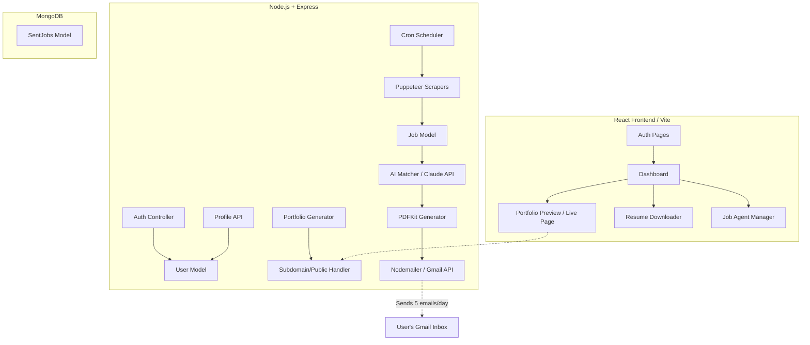

# PlaceMate Roadmap: Architectural Approach & Task Deconstruction

This roadmap outlines the implementation strategy for **PlaceMate**, transitioning from a high-level vision to a structured, step-by-step development process. 

---

## 1. Development Philosophy & Core Approach

To avoid the common pitfalls of complex application builds, we will follow three core principles:

### 1.1 Vertical Slicing over Horizontal Layering
Instead of building the entire backend database and API first, followed by the entire frontend client, we will build **vertical slices** of functionality.
* *Example*: For **User Onboarding**, we will build the database schema, the backend API, the frontend onboarding form, and local state handling as one single, continuous step.
* *Why?* This ensures we have a fully functional product at every stage, making testing and visual feedback immediate.

### 1.2 Isolation & Mock-First Strategy
External integrations (Claude API, Puppeteer, Gmail API, Razorpay) are prone to latency, cost, rate-limiting, and credentials issues.
* **We will build mock providers** for these services on day one.
* We can develop the core logic using predictable, local mocks and switch to real API connections only during final module integration.

### 1.3 Atomic Tasks
We will break down large deliverables (e.g., "Build the Job Scraper") into **micro-tasks** that take less than 2 hours each. A task is complete only when it meets a specific, verifiable **definition of done (DoD)**.

---

## 2. Core Architecture Overview



---

## 3. Phase-by-Phase Deconstruction into Tiny Tasks

Below is the breakdown of the major phases into micro-tasks, including their specific Definition of Done (DoD).

### Phase 1: Project Setup & User Authentication
Goal: Establish the repo structure, build database connection, user registration, and login.

| Task ID | Micro-Task Description | Est. Time | Definition of Done (DoD) |
| :--- | :--- | :--- | :--- |
| **1.1** | Create workspace directories, initialize Node backend and Vite React frontend, verify package configurations. | 1.5h | `npm run dev` works for both client and server; `.gitignore` configured. |
| **1.2** | Setup Express app, configure MongoDB connection using Mongoose, and implement environment variable configuration. | 1h | Server starts and prints "Connected to MongoDB" on startup. |
| **1.3** | Create the `User` schema including password hashing using `bcrypt`. | 1h | Database model test script successfully saves and verifies a user password. |
| **1.4** | Write backend authentication routes (`/api/auth/register`, `/api/auth/login`) returning JWTs. | 1.5h | Routes tested via Postman/curl and return expected JWT tokens & errors. |
| **1.5** | Build React Auth UI (Login and Sign-up pages) with responsive design and form validation. | 2h | Visual validation errors display; UI matches aesthetic standards (sleek inputs, transitions). |
| **1.6** | Connect React login/register forms to backend API, storing JWT in `localStorage` / state. | 1.5h | Successful login redirects to `/dashboard` with credentials stored. |

---

### Phase 2: Onboarding Form & Profile Management
Goal: Allow users to build their unified profile which feeds the Portfolio, Resume, and Job Matching systems.

| Task ID | Micro-Task Description | Est. Time | Definition of Done (DoD) |
| :--- | :--- | :--- | :--- |
| **2.1** | Design the profile database schema nested inside the `User` model. | 1h | Schema handles education, experiences, skills array, projects, and target preferences. |
| **2.2** | Build a multi-step onboarding wizard frontend (Steps 1–5: Personal, Education, Skills, Projects, Preferences). | 2.5h | Form state persists between steps; includes progress bar; validates fields before proceeding. |
| **2.3** | Implement auto-saving profile endpoint (`PUT /api/profile/:id`) and hook up to frontend wizard. | 1.5h | Forms automatically save draft state to database every 10 seconds or on step transition. |
| **2.4** | Create Profile View & Edit page in the client dashboard. | 1.5h | User can load their profile, make changes, click save, and see instant updates in UI. |

---

### Phase 3: Portfolio Builder (Automatic Subdomains)
Goal: Generate public portfolio sites using templates based on the user's profile.

| Task ID | Micro-Task Description | Est. Time | Definition of Done (DoD) |
| :--- | :--- | :--- | :--- |
| **3.1** | Build the core portfolio public endpoint (`GET /api/portfolio/:username`). | 1.5h | Returns the public user profile data as JSON, returns 404 if profile not found. |
| **3.2** | Develop Theme 1 (Minimal) public portfolio layout using responsive HTML/CSS. | 2h | Renders public page beautifully at `/portfolio/:username` with links to Github/LinkedIn. |
| **3.3** | Develop Theme 2 (Developer-dark) and Theme 3 (Bold) portfolio templates. | 2.5h | CSS classes update based on theme selection query parameter (e.g. `?theme=dark`). |
| **3.4** | Implement Domain/Subdomain Routing or virtual subdomains in Express. | 2h | Server maps requests to `username.placemate.tech` to render the correct user's portfolio. |
| **3.5** | Build the Dashboard Portfolio Tab (theme preview, toggle template, copy share link). | 1.5h | Users can change templates and instantly copy their live subdomain URL. |

---

### Phase 4: Resume Builder (ATS-Optimized PDF)
Goal: Generate a clean, single-page PDF resume using the profile details.

| Task ID | Micro-Task Description | Est. Time | Definition of Done (DoD) |
| :--- | :--- | :--- | :--- |
| **4.1** | Configure backend PDFKit library and construct a basic single-page grid/layout. | 1.5h | A static test script produces a well-aligned, clean PDF document. |
| **4.2** | Write the resume generation utility (`utils/pdfgen.js`) mapped to user profile fields. | 2h | Script prints full education, experiences, skills, and projects dynamically. |
| **4.3** | Implement the backend download endpoint (`GET /api/resume/:id`) sending the PDF stream. | 1h | Client clicking "Download Resume" triggers native download of the generated PDF. |
| **4.4** | Incorporate basic AI phrasing adjustments (using a simple local rewrite prompt or Claude mockup). | 1.5h | Resume descriptions use action verbs and impact-oriented sentences. |

---

### Phase 5: Puppeteer Job Scrapers
Goal: Build reliable scraping mechanisms to pull job listings from Internshala, Indeed, and LinkedIn.

| Task ID | Micro-Task Description | Est. Time | Definition of Done (DoD) |
| :--- | :--- | :--- | :--- |
| **5.1** | Define the Mongoose `Job` schema with unique `applyLink` to prevent duplicates. | 1h | Database prevents duplicate entries on insertions of the same URL. |
| **5.2** | Build Puppeteer scraper for Internshala (search by role name, extract title, company, details). | 2.5h | Node script runs locally and logs array of 10 clean job objects with all fields. |
| **5.3** | Build Puppeteer scraper for Indeed India with anti-detection configurations. | 2.5h | Script successfully extracts Indeed listings without getting blocked by Captchas. |
| **5.4** | Create the central normalization utility (`utils/normalize.js`) to standardize raw scrapings. | 1h | Scraper outputs from all boards conform to the exact same database structure. |
| **5.5** | Write database ingestion job that runs scrapers and bulk-saves matches safely. | 1.5h | Calling `ingestJobs()` populated the database with unique listings. |

---

### Phase 6: AI Matching & Resume Tailoring (Claude API)
Goal: Use LLM to calculate match scores and rewrite resumes per job description.

| Task ID | Micro-Task Description | Est. Time | Definition of Done (DoD) |
| :--- | :--- | :--- | :--- |
| **6.1** | Create Claude API client utility with rate-limiting handlers and system instructions. | 1.5h | A test command sends a profile and JD, and receives a clean JSON response. |
| **6.2** | Design and test the Job Matching Prompt (takes user profile + JD → returns score 0-100 & justification). | 2h | Claude consistently outputs JSON format `{ "score": 85, "reason": "..." }`. |
| **6.3** | Design and test the Resume Tailoring Prompt (takes profile + target JD → returns tweaked bullet points). | 2.5h | Claude returns optimized project descriptions incorporating key terms from target JD. |
| **6.4** | Integrate custom PDF generation for tailored resumes (`utils/pdfgen.js` accepting rewritten fields). | 2h | Script outputs unique PDF files customized to specific company requirements. |

---

### Phase 7: Gmail Integration & Scheduler
Goal: Set up Node-Cron to trigger the daily 8 AM job match process and email users their customized results.

| Task ID | Micro-Task Description | Est. Time | Definition of Done (DoD) |
| :--- | :--- | :--- | :--- |
| **7.1** | Configure Nodemailer with Gmail API OAuth2 authentication. | 2h | Running a test script sends a sample email with an attachment to a test inbox. |
| **7.2** | Design the responsive HTML email template for the daily job digest. | 1.5h | Email matches design spec: shows match score badge, skills matched, and CTA button. |
| **7.3** | Build the main Cron Runner (`server/utils/agent.js`) that runs matching for all Pro users. | 2.5h | Orchestrator processes a single user: matches jobs, builds PDFs, and sends emails. |
| **7.4** | Configure `node-cron` to schedule the job execution for 8:00 AM daily. | 1h | Scheduler successfully invokes agent runner at the scheduled cron pattern. |

---

### Phase 8: Subscription (Razorpay) & Job Dashboard
Goal: Protect the agent under a payment gateway, and build the history/tracking dashboard.

| Task ID | Micro-Task Description | Est. Time | Definition of Done (DoD) |
| :--- | :--- | :--- | :--- |
| **8.1** | Create the `SentJob` Mongoose schema to log sent jobs, status, and PDF paths. | 1h | Database logs links between Users, Jobs, custom scores, and application status. |
| **8.2** | Build the Job Dashboard API (`GET /api/jobs/history`, `PATCH /api/jobs/:id/applied`). | 1.5h | API allows updating application toggle state and returns sent history. |
| **8.3** | Build frontend Dashboard Job Hunting tab (applied list, charts for scores, active toggle). | 2.5h | User sees job listing history cards, can toggle application status, and pause agent. |
| **8.4** | Integrate Razorpay Checkout on frontend and create webhook route on backend. | 2.5h | Successful checkout calls backend webhook and updates user status to `plan: "pro"`. |

---

## 4. Execution Workflow: The "TDD-Lite" Loop

When building each micro-task, developers should adhere to the following workflow:

```
1. Plan / Understand Task Focus
       │
       ▼
2. Write Local Isolated Test script (e.g. test-scraper.js)
       │
       ▼
3. Implement Code logic (e.g. indeedScraper.js)
       │
       ▼
4. Run Local Test (Verify exact JSON output/behavior)
       │
       ▼
5. Integrate into Express Routes / React Components
       │
       ▼
6. Commit & Mark Task as Complete [x]
```

This prevents debug loops from compounding, allowing you to move with velocity and stability.
